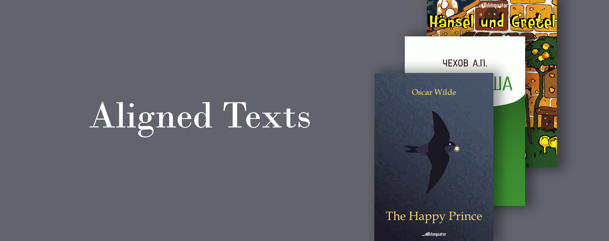

# Aligned Texts

You can find the aligned texts we use in the [Bilinguator.com](https://bilinguator.com/) website to create bilingual books!

This repository consists of literary works presented in the form of folders with aligned TXT files in different languages. Each literary work folder is located in [text/](https://github.com/bilinguator/aligned-texts/tree/main/texts) folder and has an ID. The full list of IDs and what's meant by them can be found in the [Texts list](#texts-list) chapter. Each TXT file is named according to the pattern: `{ID}_{lang}.txt`, where lang is ISO-639 language code. The aligned text files are not just plain TXT files and have quite a simple [specification](#aligned-text-files-specification). All TXT files have UTF-8 encoding.

## Aligned text files specification

### First two lines

Source files are the plain text files of TXT (not necessary) extention.

The first two lines are reserved for the information about a book. Line 1 stands for an author. Line 2 contains a title in the `<h1></h1>` tags. If an additional information about translator, publishing house, legal notice, etc. is needed, the `<delimiter>` tag is added after the `</h1>` tag and after that followed by the information. In the scripts, this additional information is called `$titleRest1` and `$titleRest2` for the two files respectively.

Example of the first two lines of a source file:

```
Antoine de Saint-Exupéry
<h1>Der Kleine Prinz</h1><delimiter>Ins Deutsche übertragen von Grete und Josef Leitgeb
```

If no information on author and/or book title is needed, leave the `<delimiter>` tag in the line 1 and/or 2. These two lines are not included in the book body which always starts with the line 3.

```
<delimiter>
<delimiter>
```

**Do not leave the lines empty, because any empty line is eliminated from the result file! It may leed to the unexpected paragraphs shift.**

### Book body

Book body consists of the paragraphs (called articles in the code) divided by line breaks (`\n`). The `<delimiter>` tag is used if the line break is typed inside the article but alignment shoud not be disturbed. Besides, there are HTML-like tags: `<h1></h1>`, `<b><\b>`, `<i></i>` which stand for headers, bold and italic styles respectively.

Illustrations can be added while creating the FB2 and EPUB files with the help of [Bilingual Formats](https://github.com/bilinguator/bilingual-formats) scripts. For this, move all the illustrations to one directory, name them as natural arabiс numbers like [here](https://github.com/bilinguator/bilingual-formats/tree/main/tests/img). We do not garantee if the script works correctly in case other symbols are provided in the file names. Add `<imgℕ>` tags to your source files, where `ℕ` is the natural arabic number. The entire article should contain the only tag and nothing else, for example, `<img1>`. If two corresponding articles contain the `<imgℕ>` tag with the same number, the illustration will be added only once.

## Texts list

|ID|Original language|Title|Authors|
|---|---|---|---|
|ajj_aakhaan_waris_shah_nu|Punjabi|I Say unto Waris Shah|Amrita Pritam|
|aptekarsha|Russian|The Chemist’s Wife|Anton Pavlovich Chekhov|
|dzikaye_palyavanne|Belarusian|King Stach’s Wild Hunt|Uładzimir Syamyonavich Karatkievich|
|dziohac|Belarusian|Tar|Maksim Haretski|
|hansel_und_gretel|German|Hansel and Gretel|Brothers Grimm|
|in_praise_of_idleness|English|In praise of idleness|Bertrand Russell|
|instytutka|Ukrainian|Instytutka|Marko Vovchok|
|jak_ptuski_dub_ratavali|Belarusian|How The Birds Tried To Save The Old Oak-tree’s Life|Jakub Kołas|
|khameleon|Russian|A Chameleon|Anton Pavlovich Chekhov|
|kuangren_riji|Chinese|A Madman’s Diary|Lu Xun|
|la_biblioteca_de_babel|Spanish|The Library of Babel|Jorge Luis Borges|
|le_petit_prince|French|The Little Prince|Antoine de Saint-Exupery|
|manifesto|German|Manifesto of the Communist Party|Karl Marx, Frederick Engels|
|manifesto_de_prago|Esperanto|Prague Manifesto of the movement for the international language Esperanto||
|nos|Russian|The Nose|Nikolai Vasilievich Gogol|
|nothing_in_biology|English|Nothing in Biology Makes Sense Except in the Light of Evolution|Theodosius Grigorevich Dobzhansky|
|o_krasnoludkach_i_sierotce_marysi|Polish|Little Orphan Mary and the Gnomes|Maria Konopnicka|
|rur|Czech|R.U.R.|Karel Čapek|
|smert_ivana_ilyicha|Russian|The Death of Ivan Ilyich|Leo Tolstoy|
|surale|Tatar|Shuraleh|Gabdulla Tukay|
|taoteching|Chinese|Tao Te Ching|Lao Tzu|
|terra_incognita|Russian|Terra incognita|Vladimir Nabokov|
|the_gift_of_the_magi|English|The Gift of the Magi|O. Henry|
|the_happy_prince|English|The Happy Prince|Oscar Wilde|
|v_katakombakh|Ukrainian|In the Catacombs|Lesya Ukrainka|
